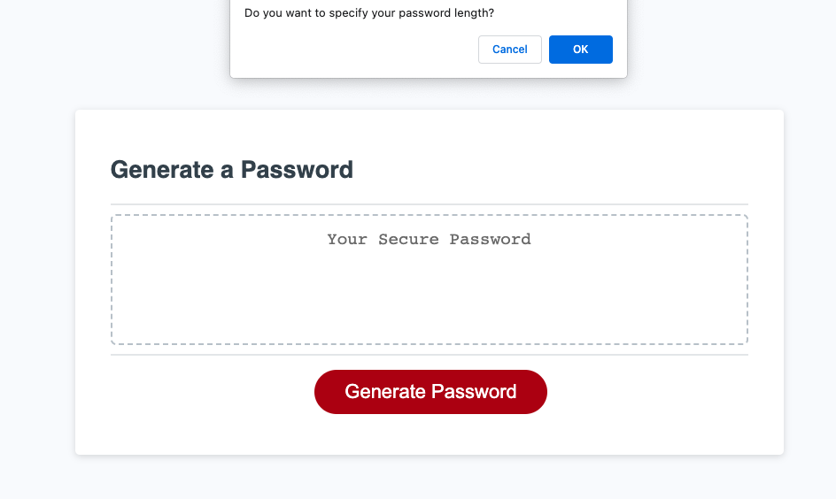

# password_checker

##Description

The purpose of thie challenge is to create a password checker that generates a password given certain parameters. 

The two main parameters here are length and type of characters. Users are prommpted to input their specifications. 

[Link](https://hiclarence.github.io/password-checker/)